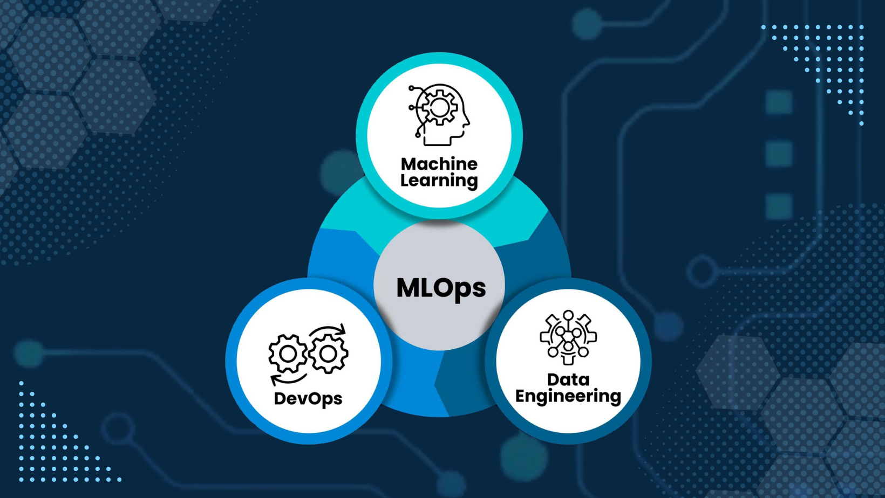
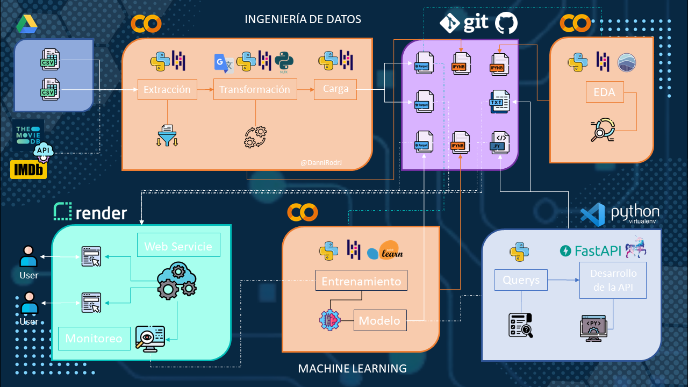
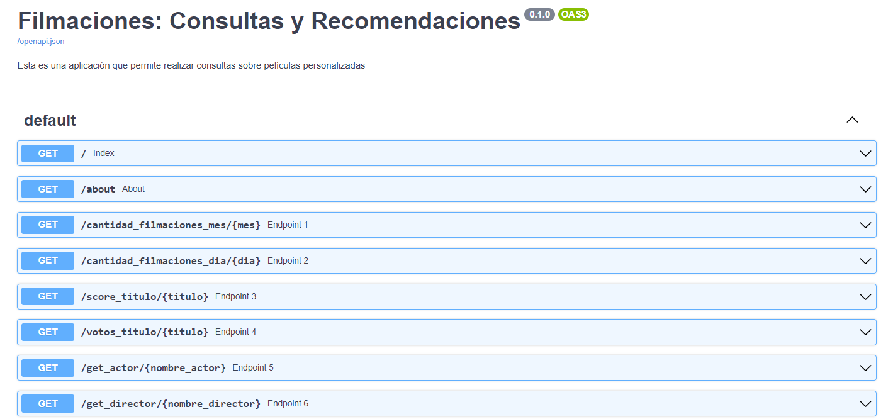

# ```Machine Learning Operations (MLOps)```



## ```Introducción```

Como parte de mi formación como Data Scientist en la edtech [Henry](https://www.soyhenry.com/), se me asignó un proyecto para desarrollar un sistema de recomendación de películas. En este proyecto, simulé un ambiente de trabajo real en el cual una _start-up_ de agregación de plataformas de streaming requería un sistema de recomendación que aún no había sido puesto en marcha. Como Data Scientist, mi responsabilidad fue desarrollar el sistema de recomendación de manera integral, desde la recolección, transformación y carga de los datos, así como el entrenamiento y despliegue del modelo de Machine Learning. Sin embargo, los datos disponibles en ese momento eran inmaduros y requerían una gran cantidad de trabajo de Data Engineer para transformarlos y prepararlos para su uso en el modelo.

## ✔️```Objetivos```

- Desarrollar un sistema de recomendación de películas y series para la _start-up_ de agregación de plataformas de streaming.

- Disponibilizar los datos de la empresa mediante una API web para permitir su consumo desde la web.

## 💡```Desarrollo del Proyecto```



Para lograr los objetivos, se llevaron a cabo los siguientes procesos:

1. ```Ingeniería de Datos```

    1.1 **Extracción, Transformación y Limpieza de los datos (ETL)**: Se realizaron las tareas necesarias para extraer los datos relevantes, transformarlos y limpiarlos para su posterior uso. Los cambios realizados fueron documentados en la carpeta 📁[etl-eda](https://github.com/DanniRodrJ/Content-Based_Movie_Recommendation_System/tree/main/etl-eda) y el código se encuentra en el notebook 👉 [ETL.ipynb](https://github.com/DanniRodrJ/Content-Based_Movie_Recommendation_System/blob/main/etl-eda/ETL.ipynb)

    1.2 **Disponibilización de los datos limpios**: Los datos limpios se pusieron a disposición en diferentes archivos, como

    👉 [api_consultation.parquet](https://github.com/DanniRodrJ/Content-Based_Movie_Recommendation_System/blob/main/api_consultations.parquet)
    👉 [movies_recommendations.parquet](https://github.com/DanniRodrJ/Content-Based_Movie_Recommendation_System/blob/main/movies_recommendations.parquet)
    👉 [movies_clean.parquet](https://github.com/DanniRodrJ/Content-Based_Movie_Recommendation_System/blob/main/dataset/movies_clean.parquet)

2. ```Desarrollo de Software```

    2.1 **Desarrollo de la API**: Se desarrolló una API utilizando el código proporcionado en el archivo 👉 [main.py](https://github.com/DanniRodrJ/Content-Based_Movie_Recommendation_System/blob/main/main.py). Esta API permitirá el acceso y la consulta de los datos disponibles.

    2.2 **Virtualización y Deployment**: Se realizó la virtualización y el despliegue de la infraestructura necesaria para que la API esté disponible y sea accesible para futuras consultas. Esta se desplegó en el siguiente enlace: 👉 [dannielarodriguez-project-mlops](https://dannielarodriguez-project-mlops.onrender.com/)

3. ```Machine Learning```

    3.1 **Análisis Exploratorio de los datos (EDA)**: Se llevó a cabo un análisis exploratorio de los datos, donde las visualizaciones más relevantes fueron documentadas en la carpeta 📁[etl-eda](https://github.com/DanniRodrJ/Content-Based_Movie_Recommendation_System/tree/main/etl-eda) y el código correspondiente se encuentra en el notebook 👉 [EDA.ipynb](https://github.com/DanniRodrJ/Content-Based_Movie_Recommendation_System/blob/main/etl-eda/EDA.ipynb). Esto implicó estudiar las características de los datos y extraer información relevante para el desarrollo del modelo.

    3.2 **Entrenamiento del Modelo**: Se entrenaron modelos utilizando el notebook 👉 [ML.ipynb](https://github.com/DanniRodrJ/Content-Based_Movie_Recommendation_System/blob/main/etl-eda/ML.ipynb). Uno de los cuales se utilizó para el sistema de recomendación de películas.

    3.3 **Deployment del Modelo de Sistema de Recomendacion de Películas**: Se realizó el despliegue del modelo entrenado, el cual se desplegó en el siguiente vínculo 👉 [dannielarodriguez-project-mlops](https://dannielarodriguez-project-mlops.onrender.com/)

## 🛠️```Tecnologías y Herramientas Utilizadas```

- **Python**: lenguaje de programación principal utilizado en el proyecto.

    

- **Librerías de Python**: se utilizaron diversas librerías de Python para diferentes tareas en el proyecto. Algunas incluyen:
  - ```pandas``` y ```numpy```: para el procesamiento y manipulación de los datos.
  - ```datetime```, ```ast```, ```json``` y ```requests```: para diversas tareas relacionadas con el manejo de fechas, la manipulación de estructuras de datos y solicitudes a la API de TMDB e IMDB.
  - ```re``` para la limpieza de los datos y el uso de expresiones regulares.
  - ```googletrans``` para dejar las descripciones de las películas en un único idioma.
  - ```nltk``` para el tratamiento de caracteres especiales en los datos.
  - ```matplotlib```, ```seaborn``` y ```wordcloud``` para el análisis exploratorio de los datos y la visualización.
  - ```scikit-learn``` para el modelado del sistema de recomendación de películas.
  - ```fuzzywuzzy``` para sugerir nombres de películas similares en caso de errores ortográficos en la entrada del usuario.

    
    
    
    
    
    

- **Google Colab**: plataforma de Jupyter Notebook basada en la nube que se utilizó para el proceso de ETL (Extracción, Transformación y Carga) de los datos, para el EDA (Análisis Exploratorio de datos) y para el Modelo de Machine Learning.

    

- **Visual Studio Code**: un editor de código fuente desarrollado por Microsoft que se utilizó para escribir y editar el código de Python para el desarrollo de las consultas a la API.
  
    

- **Virtualenv**: es una herramienta útil para crear entornos virtuales de Python que permiten instalar y manejar dependencias de forma aislada. Para este caso, se utilizó para gestionar la creación de la API.

    

- **FastAPI**: un framework de Python para construir APIs web rápidas y escalables.

    

- **Render**: servicio en la nube utilizado para implementar el modelo de Machine Learning.

    

## 🖥️```FastAPI```


Se propone el desarrollo de una API para disponibilizar los datos de la empresa a través del framework . Presentando 6 endpoints, en el archivo 👉 [main.py](https://github.com/DanniRodrJ/Content-Based_Movie_Recommendation_System/blob/main/main.py)

Primero se construyó la API de forma local y se configuraron las funciones necesarias para realizar las consultas, cargando la data desde el archivo 👉 [api_consultation.parquet](https://github.com/DanniRodrJ/Project_MLOps/blob/main/api_consultations.parquet)

Estos endpoints son los siguientes:

- ```def cantidad_filmaciones_mes(Mes)```: Consulta que devuelve la cantidad de películas que fueron estrenadas en el mes consultado en la totalidad del dataset

        Formato de salida: {'mes': mes, 'cantidad': cantidad}

- ```def cantidad_filmaciones_dia(Dia)```: Consulta que devuelve la cantidad de películas que fueron estrenadas en día consultado en la totalidad del dataset

        Formato de salida: {'dia': dia, 'cantidad': cantidad}

- ```def score_titulo(titulo_de_la_filmación)```: Consulta que devuelve el título, el año de estreno y el score de una filmación

        Formato de salida: {'titulo': titulo, 'anio': year, 'popularidad': score}

- ```def votos_titulo(titulo_de_la_filmación)```: Consulta que devuelve título, la cantidad de votos y el valor promedio de las votaciones de una filmación siempre y cuando supere las 2000 valoraciones.

        Formato de salida: {'titulo': titulo, 'año': year, 'voto_total': voto_total, 'voto_promedio': voto_promedio}

- ```def get_actor(nombre_actor)```: Consulta que devuelve el éxito de un actor medido a través del retorno de inversión, así como la cantidad de películas que en las que ha participado y el promedio de retorno.

        Formato de salida: {'actor': nombre_actor, 'cantidad_filmaciones': cantidad_peliculas, 'retorno_total': retorno_total, 'retorno_promedio': retorno_promedio}

- ```def get_director(nombre_director)```: Consulta que devuelve el éxito de un director medido a través del retorno de inversión, nombre de cada película que ha dirigido con la fecha de lanzamiento, retorno individual, costo y ganancia de la misma.

        Formato de salida: {'director': nombre_director,
            'retorno_total_director': retorno_total_director,
            'peliculas': [{
            'titulo': titulo,
            'anio': anio,
            'retorno_pelicula': retorno_pelicula,
            'budget_pelicula': budget_pelicula,
            'revenue_pelicula': revenue_pelicula
        }],
            }

Estos permitirán que los empleados de la empresa puedan hacer solicitudes específicas a la API para obtener información valiosa o realizar acciones específicas.



## 🤖```Machine Learning```


Se implementó un sistema de recomendación mediante el desarrollo de un modelo basado en contenido utilizando la librería . Para ello, se aplicó la **técnica de vectorización TF-IDF** con el objetivo de crear una matriz de vectores que describiera el contenido de las películas en función de sus sinopsis. Además, se utilizó la **medida de similitud del coseno** para calcular la similitud entre cada par de películas, y ordenarlas según su puntuación de similitud.

```python

tfidf = TfidfVectorizer(stop_words="english", ngram_range = (1, 2))
tfidf_matriz = tfidf.fit_transform(modelo1['overview_clean'])

similitud = sorted(enumerate(cosine_similarity(tfidf_matriz_1[idx], tfidf_matriz_1).flatten()), key=lambda x: x[1], reverse=True)[1:6]

```

Por lo que para el desarrollo de este sistema, se utilizó el siguiente dataset:

- Data limpia con sólo las columnas ```title``` y ```overview_clean``` 👉 [movies_recommendations.parquet](https://github.com/DanniRodrJ/Content-Based_Movie_Recommendation_System/blob/main/movies_recommendations.parquet)

El resultado final fue una función de recomendación de películas escrita en Python, que toma como entrada el título de una película y devuelve una lista de las 5 películas más similares, ordenadas según su score de similaridad. La función también maneja casos en los que el título de la película no se encuentra en la base de datos o cuando hay títulos de películas duplicados que fueron lanzados en años distintos.

Finalmente fue deployado como una función adicional de la API, llamada:

- ```def recomendacion(titulo)```: Se ingresa el nombre de una película y recomienda las similares en una lista de 5 valores.

        Formato de salida: ['titulo_recomendado1', 'titulo_recomendado2', 'titulo_recomendado3', 'titulo_recomendado4', 'titulo_recomendado5']


⚠️ Es importante mencionar que la selección final del modelo que se utilizó en este proyecto estuvo sujeta a las limitaciones del plan de desarrollador gratuito de Render que ofrece 512 MB de memoria RAM.

🎬 El modelo que mejor resultados presentó, utiliza las columnas ```title```, ```overview_clean```, ```genres```, ```director``` y ```actors```. Además maneja aquellos casos en que si el usuario ingresa el título de un película mal escrito o con letras faltantes, le retorna una sugerencia de acuerdo a si encontró alguna coincidencia en la data.

## 🌐```Despliegue del modelo y las consultas```


Para hacer el despliegue de las funciones de la API que incluyen las consultas así como el sistema de recomendación de películas se utilizó Render. El cual permitirá al equipo de la start-up poder realizar las consultas a través de una página web 👉 [dannielarodriguez-project-mlops](https://dannielarodriguez-project-mlops.onrender.com/)

## 🎥```Video y demostración```

Video de presentación de las consultas y el sistema de recomendación de películas 👉 [Video](https://drive.google.com/drive/folders/1ftUL_1Yy_I5g-TVP1WiL4sjqXCOlW-HJ?usp=sharing)

Demostraciones:

- Consulta
  
- Sistema de recomendación
  

## 🧑‍💻​```Guía de usuario```

Si quieres crear el sistema de recomendación y las consultas por tu cuenta, asegúrate de seguir estos pasos:

1. **Configuración del entorno virtual**:
   - Crea un entorno virtual para el proyecto
   - Activa el entorno virtual
2. **Archivos necesarios**: Asegúrate de tener los siguientes archivos en tu entorno
   - Código y librerías: ```main.py```, ```requirements.txt```
   - Datasets: ```movies_recommendations.parquet```, ```api_consultations.parquet```
3. **Ejecución local**:
   - Ejecuta el archivo requirements.txt con pip para instalar las dependencias.
   - Luego, ejecuta el comando ```uvicorn main:app --reload``` para iniciar la aplicación.
   - Puedes encontrar una guía más detallada siguiendo el [tutorial](https://fastapi.tiangolo.com/tutorial/) adjunto.
4. **Despliegue en Render:**
   - Si deseas desplegar el proyecto en Render, te recomiendo seguir este [tutorial](https://github.com/HX-FNegrete/render-fastapi-tutorial) para obtener instrucciones detalladas.

Recuerda que al replicar este proyecto, puedes hacer un fork del repositorio en la parte superior derecha, reutilizar y modificar el código. No olvides mencionar este repositorio como fuente en tu proyecto 😊​.

## 👩‍💻 ```Desarrollador```

Si deseas contactarme, simplemente haz clic sobre mi nombre y serás redirigido a mi perfil de LinkedIn. Estaré encantada 🤗 de responder a tus consultas y compartir más detalles sobre mis habilidades y experiencia.

<div align="center">

*MLOps Engineer*
| [<br><sub>Danniela Rodríguez</sub>](https://www.linkedin.com/in/danniela-rodriguez-jove-/)
| :---: |

<div align="left">

## 🙌 ```Agradecimiento y Actualizaciones```

*¡Gracias por revisar este proyecto* 🤗! *Si deseas estar al tanto de futuras actualizaciones, te invito a marcar el repositorio con un estrella* ⭐​. *Puedes encontrar la opción para hacerlo en la parte superior derecha de la página. Tu apoyo es muy apreciado.*
